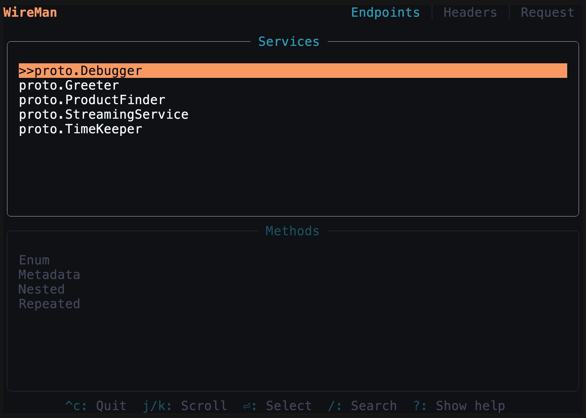

<p align="center">
    
    
</p>

<div align="center">
    
[](https://github.com/preiter93/wireman/actions/workflows/ci.yml)

</div>

# What is WireMan?

WireMan is a terminal-based gRPC client with a user-friendly interface. It reads `.proto` files from a config file and keeps a history of requests.
WireMan is an ideal choice for developers testing gRPC endpoints directly from the terminal.

# Getting Started with WireMan

This guide will walk you through the steps to set up and run WireMan.

## Prerequisites

- Rust: [Minimum required Rust version is 1.70] ([Installation Guide](https://www.rust-lang.org/tools/install))

## Installation

1. Clone the repository:

    ```bash
    git clone https://github.com/preiter93/wireman.git
    ```

2. Build in release mode:

    ```bash
    cd wireman
    cargo build --release
    ```

3. Copy the binary to your PATH, e.g.:

    ```bash
    cp target/release/wireman /usr/local/bin
    ```
    
    Alternatively, you can create an alias to the binary in your `.bashrc` or `.zshrc` file:

    ```bash
    echo "alias wireman='CURRENT_DIRECTORY/target/release/wireman'" >> ~/.zshrc
    ```

## Configuration

1. Set the `WIREMAN_CONFIG_DIR` environment variable to specify the directory where your configuration file will be located:

    ```bash
    export WIREMAN_CONFIG_DIR=~/.config/wireman
    ```

2. Create the directory specified in `WIREMAN_CONFIG_DIR`:

    ```bash
    mkdir -p ~/.config/wireman
    ```

3. Create a `wireman.toml` file in the specified directory. Here's an example configuration:

    ```toml
    includes = [
        "$HOME/your-project"
    ]
    
    files = [
        "a-proto-file-in-your-project.proto"
    ]
    
    [server]
    default_address = "http://localhost:50051"
    
    [history]
    directory = "$WIREMAN_CONFIG_DIR/history"  # Optional. Defaults to $WIREMAN_CONFIG_DIR/history.
    autosave = true                            # Optional. Autosaves history on request. Defaults to true.
    disabled = false                           # Optional. History is enabled by default.
    
    [logging]
    directory = "$WIREMAN_CONFIG_DIR"          # Optional. Defaults to $WIREMAN_CONFIG_DIR.
    level = "Debug"                            # Optional. Defaults to Debug.
    
    [ui]
    hide_footer_help = false                   # Optional. Defaults to false.
    ```

    Replace with the appropriate values for your project.
    
4. Optionally, you can now verify the setup configuration
    ```bash
    wireman check 
    ```

## Usage

1. After adding the protos in the config, start `wireman`.
 
2. The first page of Wireman will list your grpc services and their methods. You can navigate with `up`/`down` or `j`/`k`, select with `Enter` or unselect with `Esc`, then click `Tab`.

3. The second page is the message screen. Edit your request message, you can format it with `Ctrl+f`. Then click tab. The navigation of the editor is vim-inspired: use `h`, `j`, `k`, `l` for motion, go into insert mode with `i`, and escape insert mode with `Esc`. For more details, refer to [edtui](https://github.com/preiter93/edtui).
 
4. The third page is the config screen where you can edit the address or metadata. Wireman allows for using bash scripts to get your tokens. Place the name of your script in the bearer token field, which must be in your PATH, between `$()`. For example, if you have a bash script named `getToken.sh` that prints the Bearer token `ey...`, you would use `$(getToken.sh)` (the script output should not include the word 'Bearer', as it is automatically added). Additional headers can be added with `Ctrl+a` and deleted with `Ctrl+d`. Go to the request page with Shift+Tab or click tab twice.

5. Now you can make the request by clicking Enter. You can save it with `Ctrl+s`. Saved requests are stored in spots 1 to 5. Switch to a spot by clicking the respective number. You can restore the default request with `Ctrl+d`, which deletes the history. You can also cancel a request with Esc. To copy the response: Navigate to the response by clicking down, enter visual mode by pressing `v`, select everything and copy the selected text by pressing `y`. Or follow step 6.

6. If you want to get the current request as a gRPCurl command, click `Ctrl+y` on the request tab, and it's copied to your clipboard.

## Troubleshooting

Wireman logs important information and errors to assist in troubleshooting. By default, logs are stored in `$WIREMAN_CONFIG_DIR/wireman.log`.Make sure to check this log file if you encounter any unexpected behavior or errors while using the application.

If you are unable to resolve the issue on your own or need further assistance, please don't hesitate to [open an issue](https://github.com/preiter93/wireman/issues).

## Demo



## Roadmap

- [x] Unary gRPC
- [x] Set host address
- [x] Set authentication headers
- [x] Request History
- [x] Defaults of repeated/nested fields
- [x] Yank/Paste from clipboard
- [x] Yank request as grpcurl command
- [x] Vim like editor feeling
- [x] Show loading indicator
- [x] Metadata headers

Planned
- [ ] Edit config file in app
- [ ] Provide installation help
- [ ] Custom themes
- [ ] Command line help

Maybe
- [ ] Streaming gRPC
