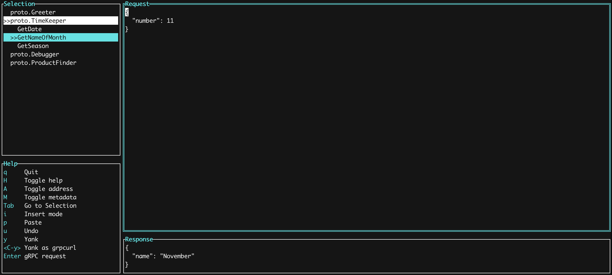

## What is StellaRPC?

StellaRPC is a gRPC client that runs in the terminal! Simply put your proto files in a config and be ready to make gRPC request

## Demo

## Features

#### Keep a request history

You can now save your last request (S). And you can browse the history of all saved requests (H), including the default template. 
This way you never have to think again about what goes into this request and whether you really need that parameter over there.

#### Yank as `grpcurl` request

stellaRPC supports copying the request data as a `grpcurl` command. This makes collaborating with peers a breeze :) 
Just go to the request page and type `ctrl+y`.

### Roadmap

- [x] List Services & Methods
- [x] Request can be edited
- [x] TLS support
- [x] Unary gRPC client calls
- [ ] Streaming gRPC client calls
- [x] Metadata specification
- [x] Server address specification
- [x] Request History
- [ ] Extended message description
- [x] Defaults of repeated/nested fields
- [x] Yank/Paste from clipboard
- [x] Yank request as grpcurl command
