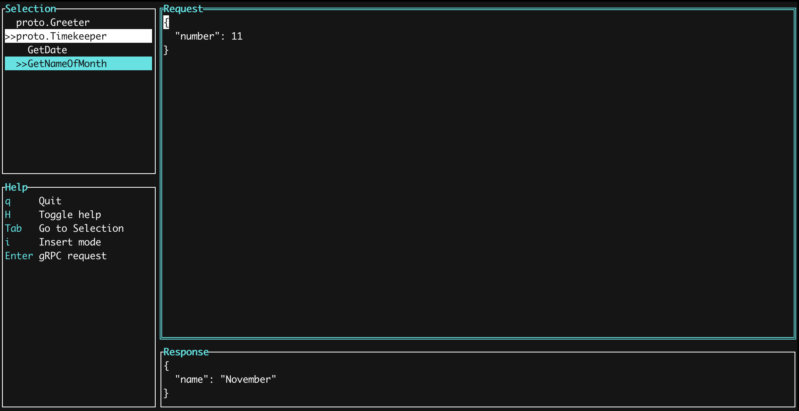

## ProtoTUI

ProtoTUI is a gRPC client that runs in the terminal. Simply load a bunch of proto files into a config file and start to make gRPC request. Enjoy!

## Features:
- [x] List Services & Methods
- [x] Request can be edited
- [x] TLS support
- [x] Unary gRPC client calls
- [ ] Streaming gRPC client calls
- [x] Metadata specification
- [x] Server address specification
- [ ] Request History
- [ ] Extended message description
- [x] Defaults of repeated/nested fields
- [x] Yank/Paste from clipboard
